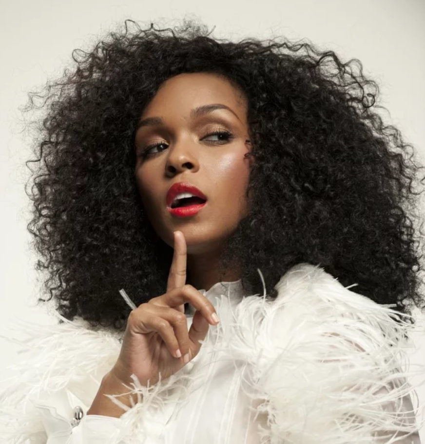
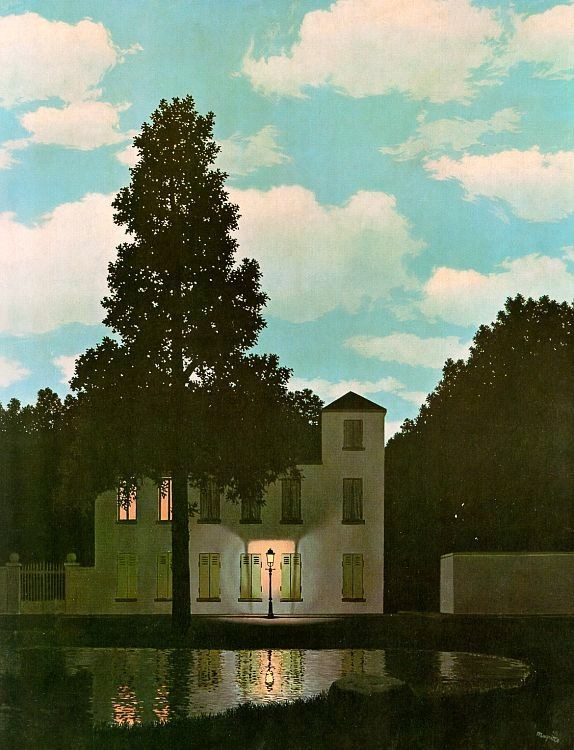
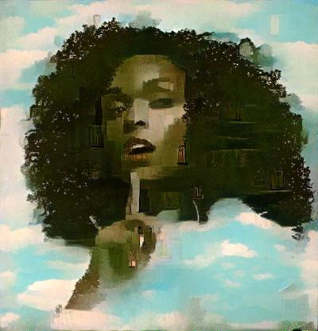

## Neural Style Transfer Exercise

There's a course on *Udacity* called **Introduction to Deep Learning with PyTorch**, it's good *free introductory* course. This exercise is part of this course, *style transfer* lesson. Basically, goal is to generate a target image given a content image and style image, such that *target image* has *style of style image* and *content of content image*. For example,

Content Image, 

Style Image, 

Target Image generated from content and style images,

 
 

Such can be achieved using a concept called *neural style transfer*. To understand this concept I highly recommend to watch videos of style transfer lesson in above linked course on Udacity. Also to understand this lesson, good knowledge of *convolutional neural networks* is also required.

 

You can try different images and see results for yourself, by editing filenames in the notebook. I recommend running this notebook on kaggle or google colab (GPU kernel obviously) for faster runtime. 